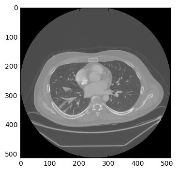

# Data Science Bowl 2017 Solution

A quick review of my entry to the [Kaggle Data Science Bowl 2017](https://www.kaggle.com/c/data-science-bowl-2017). The final submission (bluesky) ranked 95th from 1972 teams.

## Overview
The competation provided CT scans of lungs and asked competitors to predict whether the patient would develop cancer within 1 year of the scan.

The approach taken was quite basic with the following steps:

 1. Utilize data from the [LUNA 2016 challenge](https://luna16.grand-challenge.org/). Preprocessing the LUNA16 images to segment the lungs using scripts from https://github.com/gzuidhof/luna16.
 2. Build a [U-Net](https://arxiv.org/abs/1505.04597)  model to predict nodules (using Keras and Tensorflow)
 2. Predict both on the full LUNA16 and DSB data using the U-Net model and extract 32x32x32 voxels from most prominent prediction volumes.
 3. Build various 3D convolution nets to perform false-positive reduction using the LUNA16 data (using Keras and Tensorflow)
 4. Apply the false-positive models to output probabilities and combine into a prediction Random Forest model using the Stage 1 labels.
 5. Utilize the Random Forest model to output final probabilities for stage2

## Infrastructure / estimated running times
I used:

 * Intel(R) Core(TM) i5-7600 CPU @ 3.50GHz with 64G memory
 * 1TB disk
 * A GTX 1070 GPU

I did not time the whole process end to end, but estimate on above took around 3 days.

## Dependencies

 * Keras (tested on 1.2.1)
 * Tensorflow (tested on 0.12.1)
 * scikit-learn (tested on 0.18.1)

## Running

 * You will need to download the LUNA16 data and the DSB data and follow the Makefile
 * I have not had a chance to test the full end-to-end "make everything"
 
## Caveats/Improvements

 * Top teams used the malignancy markers from LUNA16 data and more creative U-Net predictions and combining of results.
 * The repo is currently missing creating multiple unet models to provide more data to the 3D conv net false positive models.
 * I didn't use Dice coefficient for unet model but cross entropy which is probably a mistake. Added to the last point this could be used to create multiple unet models.

